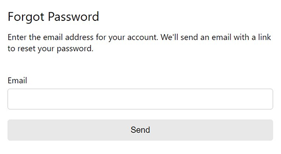

## Forgot Password

React forgot password component in Typescript, Formik and Yup for validation. It accepts props including submit and success handlers, custom fields, custom Yup schema, choice of default or custom success component, header and more.



### Install
```
npm install @unleashit/forgot-password
```

### Example

```javascript
class ForgotPasswordDemo extends React.Component {
  async forgotPasswordHandler(values) {
    // should return a Promise in the shape of LoginHandlerResponse below
    return await fetch(
      'https://api.example.com/auth/reset',
      {
        method: 'POST',
        headers: {
          'Content-Type': 'application/json',
        },
        body: JSON.stringify(values),
      },
    ).then(resp => resp.json());
  }

  onSuccess(serverResponse) {
    // serverResponse has server's full response from forgotPasswordHandler().
    console.log(serverResponse);
  }

  render() {
    return <ForgotPassword
      forgotPasswordHandler={this.forgotPasswordHandler}
      onSuccess={this.onSuccess}
      showDefaultConfirmation={true}
    />;
  }
}

export default ForgotPasswordDemo;

```
Notes: a `showDefaultConfirmation` prop set to true will show a default confirmation message. `onSuccess` is optional and can take either a function or a React component instance. If you pass in a function, it will be called with the server's reponse. If you instead pass a component, it will render it.

### Custom Fields

It's possible to replace the default email field with custom field(s) and attributes by adding a `customFields` prop. The forgotPasswordHandler will be called with their values after passing validation.

This array of fields will replace the defaults, so don't forget to add email back if you need it. If you create and pass in a Yup schema with matching name attributes, it will properly validate.

Currently input, select, checkbox and textarea fields are supported.

```javascript
<ForgotPassword
  forgotPasswordHandler={this.forgotPasswordHandler}
  onSuccess={<MyCustomConfimationComponent />}
  schema={schema}
  customFields={[
    {
      element: 'input',
      type: 'text',
      name: 'email',
      label: 'Email'
    },
    {
      element: 'input',
      type: 'text',
      name: 'secretQuestion1',
      label: 'What is your mother\'s maiden name?'
    },
    {
      element: 'input',
      type: 'text',
      name: 'secretQuestion2',
      label: 'What was the name of your first pet?'
    }
  ]}
/>

// yup schema
const schema = yup.object().shape({
  email: yup
    .string()
    .email()
    .max(56)
    .required(),
  secretQuestion1: yup
    .string()
    .max(512)
    .required(),
  secretQuestion2: yup
    .string()
    .max(512)
    .required()
});
```

```typescript
// forgotPasswordHandler() should return this shape:

interface ForgotPasswordHandlerResponse {
  success: boolean;
  errors?: {
    // error msg to print in browser when auth fails
    serverMessage: string;
    // optionally validate anything else on server
    // key is the field's name attr, value is error msg to display
    [key: string]: string; 
  };
}

// customFields prop should be an array of objects in this shape:
interface CustomField {
  element: 'input' | 'select' | 'textarea';
  type: string;
  name: string;
  label: string;
  options?: string[][]; // for select element
  defaultChecked?: boolean; // for checkbox
  custAttrs?: { [key: string]: string };
}

```
### CSS

Basic css can be imported: `import '@unleashit/forgot-password/dist/style.css';`, or you can pass in a custom CSS module. Please see CSS in the main readme of the repo for more info.

### Props

| Name      | Type |  Description | default |
| ----------- | ----------- | ---------| ------- |
| forgotPasswordHandler      | (values: any) => Promise\<ForgotPasswordHandlerResponse>       | Called on submission and after validation. Use to check auth. Should return the above interface | required |
| onSuccess      | (resp: LoginHandlerResponse) => any &#124; React.Element | Called if forgotPasswordHandler returns success. Provides the server response from forgotPasswordHandler() if a function is passed. If a component instance is passed instead of a function, it will render | n/a |
| showDefaultConfirmation    | boolean                | If set to true, show a default confirmation message | false |
| schema      | yup.Schema\<ForgotPasswordSchema>     | Yup schema to override the default | standard validation |
| header      | React.FC     | React component to override default header | basic header |
| loader      | React.FC     | React component to override default loader | Sending... |
| customFields  | CustomField[]  | Array of custom fields. Replaces defaults (including email). Custom validation schema will be needed.  | n/a   |
| cssModuleStyles  | { [key: string]: string }  | CSS Module object that optionally replaces default. Class names need to match default names. | default CSS |
