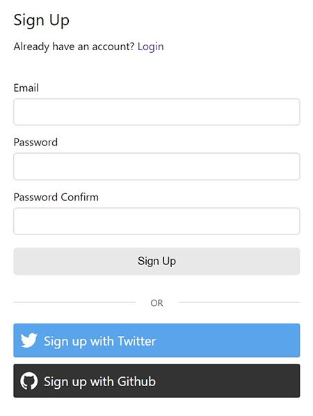

## Signup

React signup component in Typescript, Formik and Yup for validation. It accepts props including handlers, custom fields, custom Yup schema, custom header and more. Basic CSS is available.



### Install

```
npm install @unleashit/signup
```

### Example

```javascript
class SignupDemo extends React.Component {
  async signupHandler(values) {
    // should return a Promise in the shape of LoginHandlerResponse below
    return await fetch('https://api.example.com/auth', {
      method: 'POST',
      headers: {
        'Content-Type': 'application/json',
      },
      body: JSON.stringify(values),
    }).then(resp => resp.json());
  }

  onSuccess(resp) {
    // set auth state, etc. resp has full server response from loginHandler().
    window.location.href = '/signed-in';
  }

  render() {
    return <Signup signupHandler={this.signupHandler} onSuccess={this.onSuccess} />;
  }
}

export default SignupDemo;
```

### Custom Fields

It's possible to replace the default fields with custom fields and attributes by adding a `customFields` prop. The signupHandler will be called with the values.

This array of fields will replace the defaults, so don't forget to add email/username, password and password confirmation if you need them. If you create a Yup schema with matching name attributes, it will properly validate.

Currently input, select and checkbox fields are supported.

```javascript
<Signup
  signupHandler={this.signupHandler}
  onSuccess={this.onSuccess}
  schema={schema}
  customFields={[
    {
      elementType: 'input',
      type: 'text',
      name: 'email',
      label: 'Email'
    },
    {
      elementType: 'input',
      type: 'password',
      name: 'password',
      label: 'Password'
    },
    {
      elementType: 'input',
      type: 'password',
      name: 'passwordConfirm',
      label: 'Type password again'
    },
    {
      elementType: 'select',
      name: 'color',
      label: 'Choose a color',
      options: [
        ['', '- select -'],
        ['red', 'red'],
        ['green', 'green'],
        ['blue', 'blue'],
        ['yellow', 'yellow']
      ],
    },
    {
      elementType: 'checkbox',
      name: 'newsletterOptIn',
      label: 'Subscribe to our newsletter?',
      defaultChecked: true,
      defaultValue: true
    },
  ]}
/>

// yup schema
const schema = yup.object().shape({
  email: yup
    .string()
    .email()
    .max(56)
    .required(),
  password: yup
    .string()
    .min(8)
    .max(512)
    .required(),
  passwordConfirm: yup
    .string()
    .oneOf([yup.ref('password'), null], 'Passwords must match')
    .required(),
  color: yup
    .string()
    .oneOf(['red', 'green', 'blue', 'yellow'])
    .required(),
});
```

```typescript
// signupHandler() should return this shape:
interface SignupHandlerResponse {
  success: boolean;
  errors?: {
    serverAuth: string; // error msg to print in browser when auth fails
    [key: string]: string; // optionally validate anything else on server
  };
}

// customFields prop should use an array of objects in this shape:
interface CustomField {
  elementType: 'input' | 'select' | 'checkbox'; // more will be added
  type: string;
  name: string;
  label: string;
  options?: string[][];
  custAttrs?: { [key: string]: string };
}

```

### CSS

Basic css can be imported if desired: `import '@unleashit/signup/dist/style.css';` . Class names use a CSS modules hash to avoid name collisions.

### Props

| Name          | Type                                            | Description                                                                                                                       | default             |
| ------------- | ----------------------------------------------- | --------------------------------------------------------------------------------------------------------------------------------- | ------------------- |
| signupHandler | (values: {}) => Promise\<SignupHandlerResponse> | Called on submission and after validation. Use to register user and validate serverside. Should return the above interface        | required            |
| onSuccess     | (resp: SignupHandlerResponse) => any            | Called if signupHandler returns success. Provides the server response from serverHandler. Use to store auth state, redirect, etc. | required            |
| schema        | yup.Schema\<LoginSchema>                        | Yup schema to override the default                                                                                                | standard validation |
| header        | React.FC                                        | React component to override default header                                                                                        | basic header        |
| loader        | React.FC                                        | React component to override default loader                                                                                        | Signing up...       |
| loginUrl      | string                                          | Url for login page. Use only if using default header                                                                              | /login              |
| customFields  | CustomField[]                                   | Array of custom fields. Replaces defaults (including email/password). Custom validation schema will be needed.                    | n/a                 |
